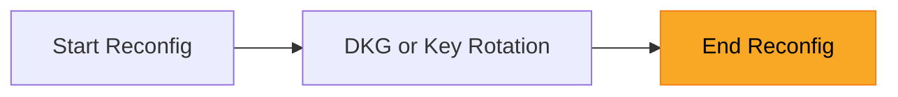

# Reconfiguration

One of the most important parts of the hashi protocol is reconfiguration. This
is because one of the key parts of reconfiguration is the old committee
sharing key shares of the MPC key with the new committee.

The hashi service will monitor the Sui epoch change and will immediately kick
off hashi reconfig once Sui's epoch change completes. During hashi's reconfig,
in progress operations (e.g. processing of withdrawals) will be paused and will
be resumed and processed by the new committee upon the completion of
reconfiguration.


### Start Reconfig


Each hashi node monitors Sui for epoch changes. When a new Sui epoch is
detected and the hashi epoch has not yet advanced to match, the node knows that
a reconfiguration is needed. A committee member submits an on-chain transaction
by calling `hashi::reconfig::start_reconfig` to signal that reconfiguration
should begin for the target epoch:

```move
entry fun start_reconfig(
    self: &mut Hashi,
    sui_system: &SuiSystemState,
    ctx: &TxContext,
)
```

This sets a pending epoch change flag in the on-chain state, which pauses
normal operations (deposits, withdrawals) until reconfiguration completes. The
new committee membership is determined by the set of validators who have
registered with hashi for the new epoch, determining stake-weights from the Sui
Validator set stake-weights.


### DKG or Key Rotation


The MPC key protocol runs among the new committee members. Which protocol is
used depends on whether this is the first hashi epoch or a subsequent one:

- **Initial DKG** -- if there is no existing MPC public key (i.e. this is
  the genesis epoch), the committee runs the distributed key generation
  protocol to produce a fresh master key.
- **Key Rotation** -- if an MPC public key already exists, the old
  committee's key shares are redistributed to the new committee. The old
  committee members act as dealers and the new committee members act as
  receivers.

In both cases, the output is a `DkgOutput` containing the new committee's key
shares and the MPC public key. See [MPC protocol](./mpc-protocol.md) for
details.

Each committee member then signs a `ReconfigCompletionMessage` containing
the target epoch and the MPC public key using their BLS12-381 key. Nodes
collect signatures from each other via RPC until a quorum (2/3 of committee
weight) is reached, producing a BLS aggregate signature certificate. This
ensures that a supermajority of the new committee agrees on the key protocol
output before the epoch transition is finalized on-chain.

### End Reconfig



A committee member submits the aggregate signature certificate on-chain by
calling `hashi::reconfig::end_reconfig`:

```move
entry fun end_reconfig(
    self: &mut Hashi,
    mpc_public_key: vector<u8>,
    signature: vector<u8>,
    signers_bitmap: vector<u8>,
    ctx: &TxContext,
)
```

The on-chain contract verifies the certificate, commits the generated MPC
public key if DKG was run or verifies that the key remains unchanged from the
previous epoch, advances the hashi epoch, and clears the pending epoch change
flag.

Once the new epoch begins the new committee then initializes the signing state
for the epoch by running the presigning protocol to generate a batch of
presignatures needed for the threshold Schnorr signing protocol (see [MPC
protocol](./mpc-protocol.md)). Once presignatures are ready, normal operations
resume for processing deposits and withdrawals.
