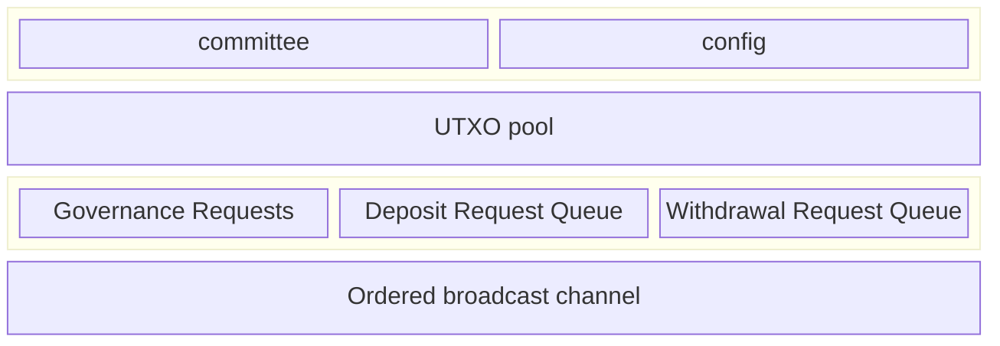

# Service

Every committee member will be responsible for running a hashi node service.
Each hashi node will expose an http service, secured by TLS leveraging a
self-signed cert (ed25519 public key can be found in the Hashi System State
object) which will serve a gRPC `HashiService`.

## Sui Contracts

- The hashi move package(s) will be published as normal packages. In other
  words, the hashi packages will *not* be system packages and will *not* be a
  part of sui's framework.

## Stateless

A main goal of this design is the make the hashi service as stateless as
possible. Outside of any cryptographic material required for participating in
the protocol, any state critical for the functioning of the service must be
stored on Sui as a part of the live object set and knowledge of any historical
transactions or events previously emitted must not be needed for correct
operations of the service.

The set of data structures and state that are kept on chain are as follows:

