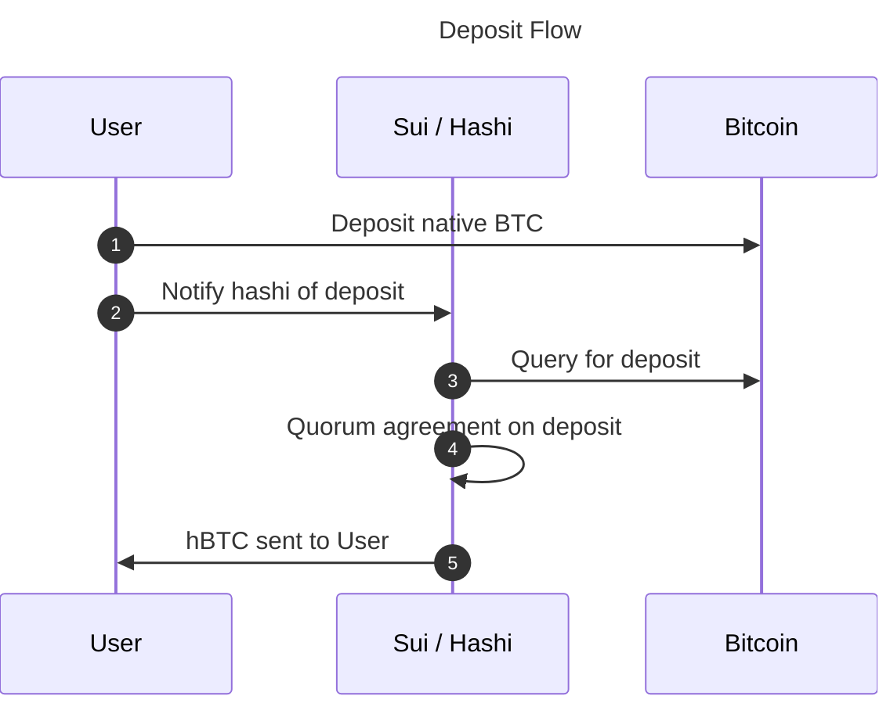
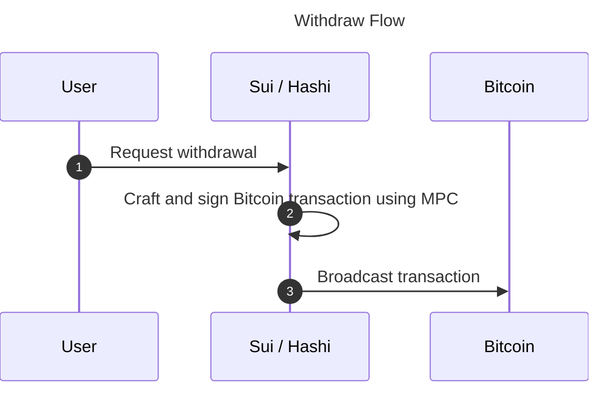

# User Flows

There are two main user flows for interacting with `hashi`, deposits and
withdrawals.

## Deposit Flow

In order for a user to leverage their `BTC` on Sui (e.g. as collateral for a
loan), they'll need to deposit the `BTC` they want to leverage to a hashi mpc
controlled bitcoin address.

### BTC deposit address

Every Sui address has its own unique Hashi Bitcoin deposit address. See
[address scheme](./address-scheme.md) for the full derivation details.

### Deposit

Once a user's deposit address has been determined, they can initiate a deposit to
hashi.

1. Broadcast a Bitcoin transaction depositing `BTC` into the user's unique
   deposit address.
1. Notify hashi of the deposit by submitting a transaction to Sui including the
   deposit transaction id.
1. Hashi nodes will query Bitcoin and watch for confirmation of the deposit
   transaction.
1. Hashi nodes communicate, waiting till a quorum has confirmed the deposit
   (after X block confirmations).
1. Hashi confirms the deposit on chain, minting the equivalent amount of `hBTC`
   and transferring it to the user's Sui address. The user can then immediately
   use the `hBTC` to interact with a defi protocol to, for example, leverage the
   `hBTC` as collateral for a loan in `USDC`.

## Withdraw Flow

Once a user has decided they want their `BTC` back on Bitcoin (e.g. they've paid
off their loan) they can initiate a withdrawal.

### Withdraw

1. User sends a transaction to Sui with the amount of `hBTC` they would like to
   withdraw and the Bitcoin address they want to withdraw to.
1. Hashi will pick up the withdrawal request and will craft a bitcoin
   transaction that sends the requested `BTC` (minus fees) to the provided
   Bitcoin address and uses MPC to sign the transaction.
1. The transaction is broadcast to the Bitcoin network.
